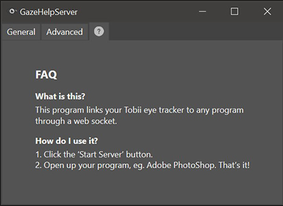

# GazeHelpServer
The accompanying server for the GazeHelp Photoshop plugin, complete with a simple dark-mode GUI. It can also be used to send Tobii gaze point data to any program's WebSocket, and supports changing ports on the fly.

This project was completed for the HCI Project (INFO90008) at the University of Melbourne.

# How to use
Open the GazeHelpServer.sln solution file in Visual Studio, build the code and you're good to go!

# Screenshots
\
Main screen of the GUI\
\
\
Success message when connected\
\
\
Error message when stopped\
\
\
Advanced settings tab\
\
\
FAQ tab, to get you up and running!\
